# 🛍️ E-commerce Website for Clothing Business

This is a dynamic e-commerce website developed as part of my academic project. It is designed for small clothing businesses to sell their products online, manage inventory, and handle customer orders with ease.

## 🔑 Key Features

- 🛒 User registration and login
- 👕 Product browsing and categorization
- 🧺 Add to cart and checkout functionality
- 💳 Basic payment system simulation
- 🧑‍💼 Admin panel for product & order management
- 📱 Fully responsive UI for mobile & desktop

## 🛠️ Tools & Technologies

| Area        | Tools Used                              |
|-------------|------------------------------------------|
| Frontend    | HTML, CSS, JavaScript                   |
| Backend     | PHP                                     |
| Database    | MySQL                                   |
| Environment | XAMPP (Apache + MySQL + phpMyAdmin)     |
| Editor      | Visual Studio Code                      |

## 📷 Screenshots
### 🔹 Homepage
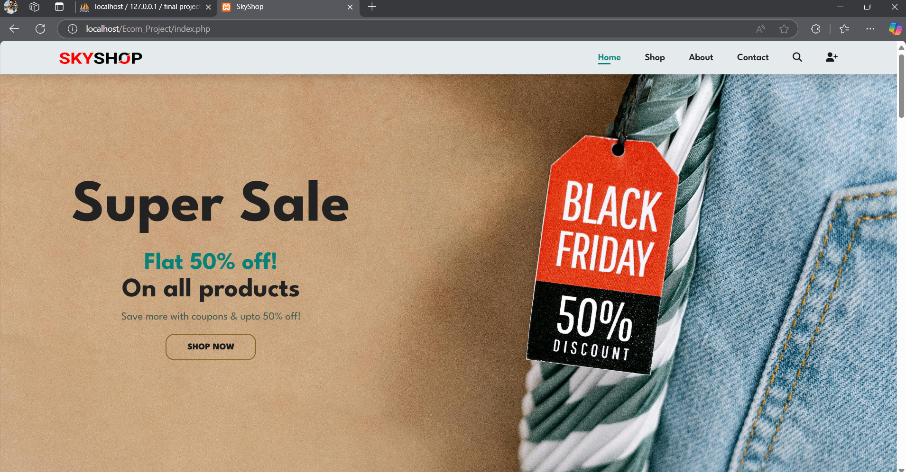
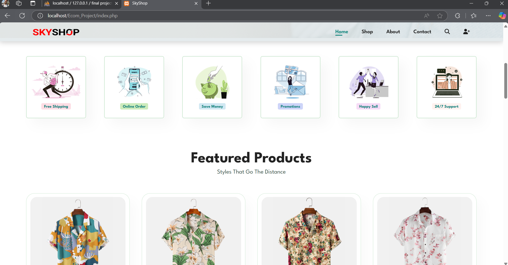
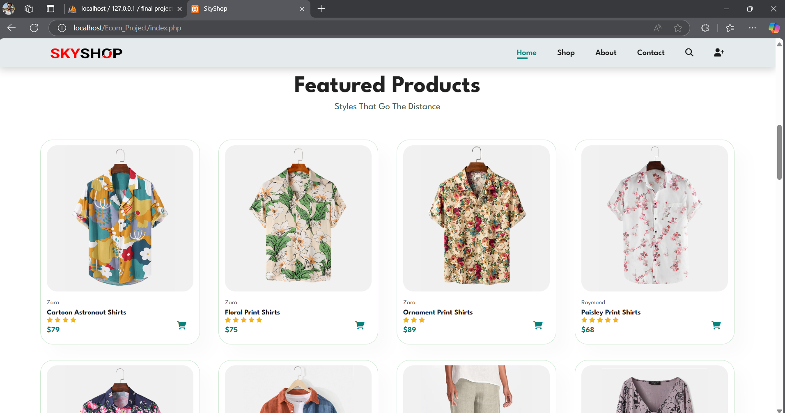
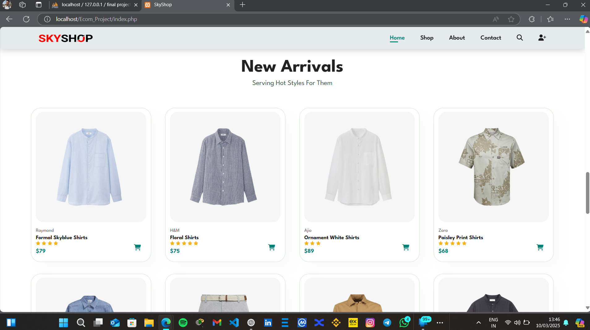
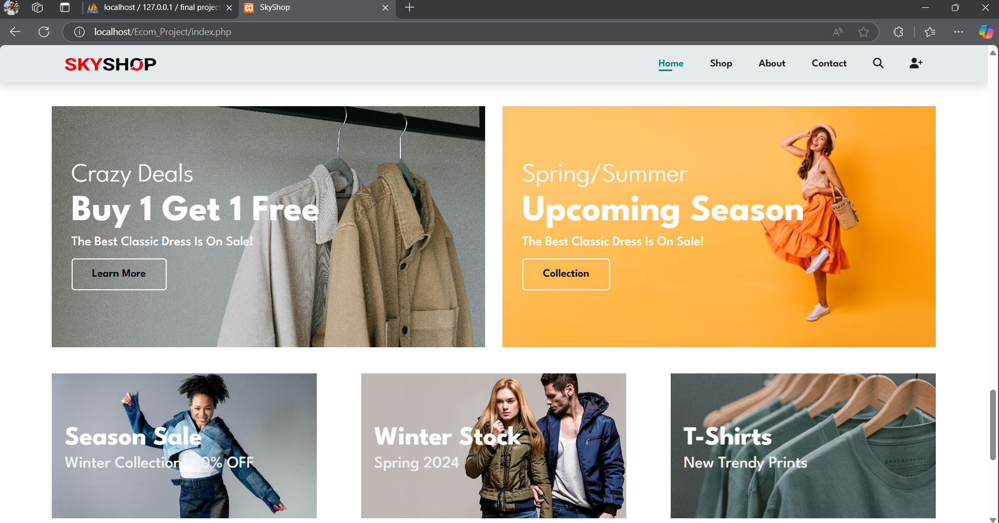

### 🔹 About Us
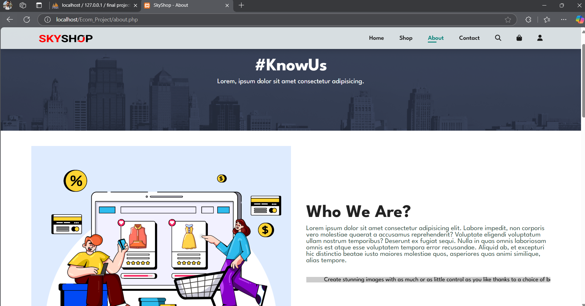
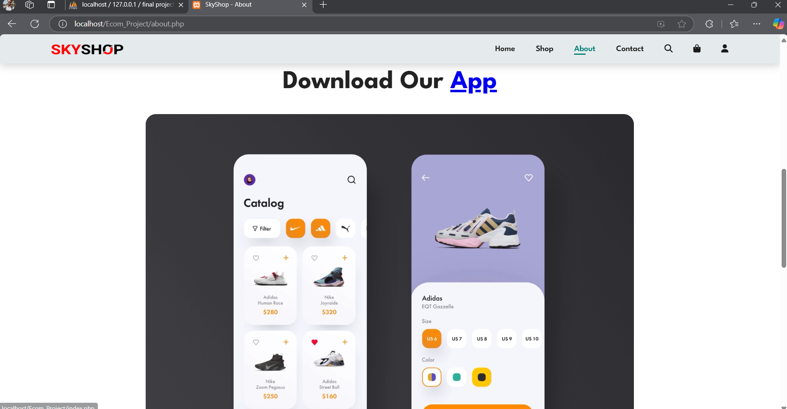

### 🔹 Contact Us

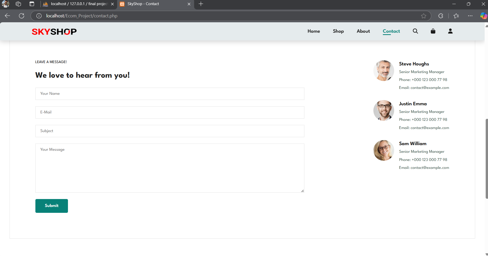

### 🔹 Shop Pages
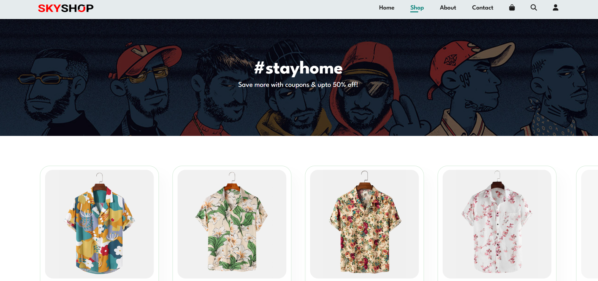
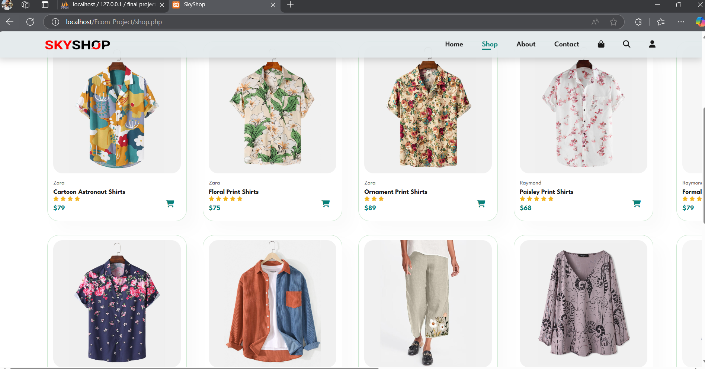

### 🔹 Product Details

### 🔹 Cart & Checkout
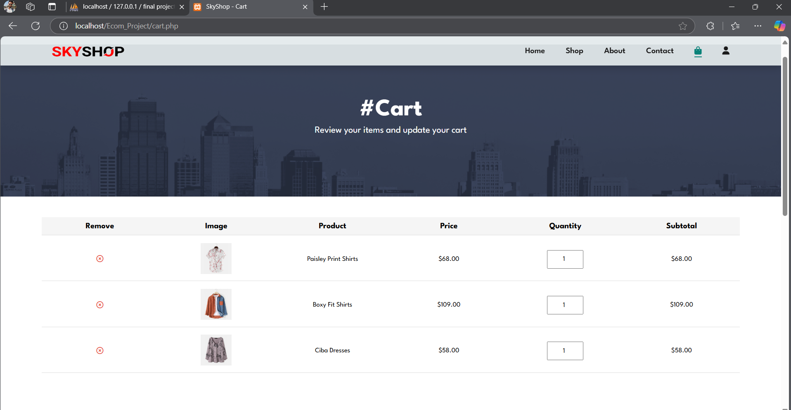
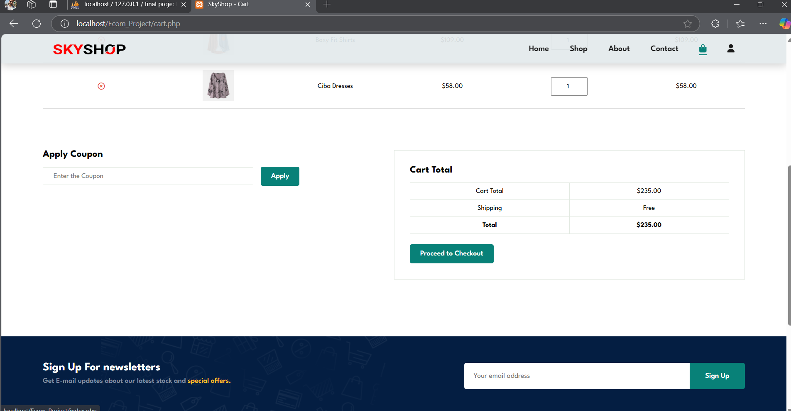
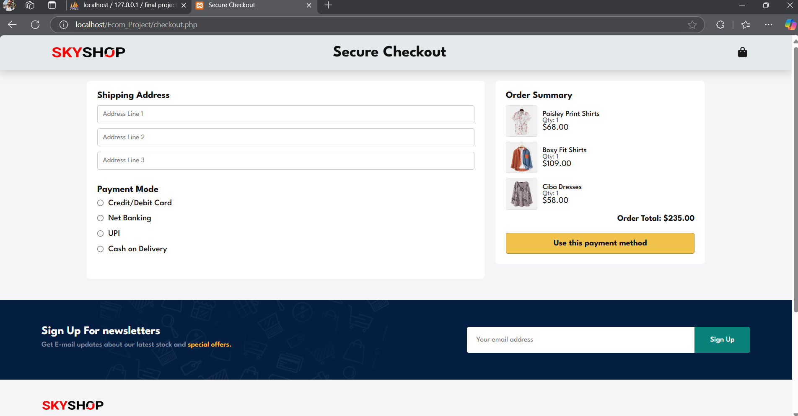

### 🔹 User Account
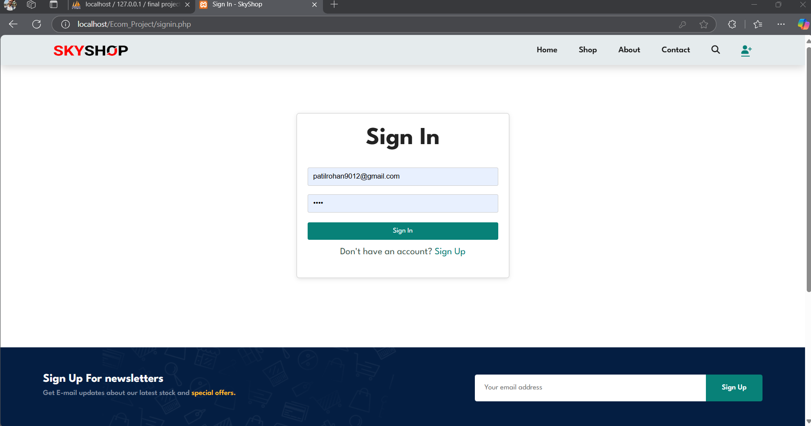
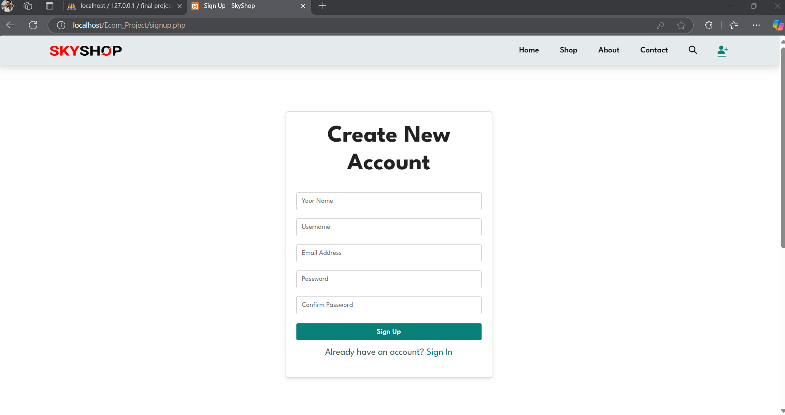
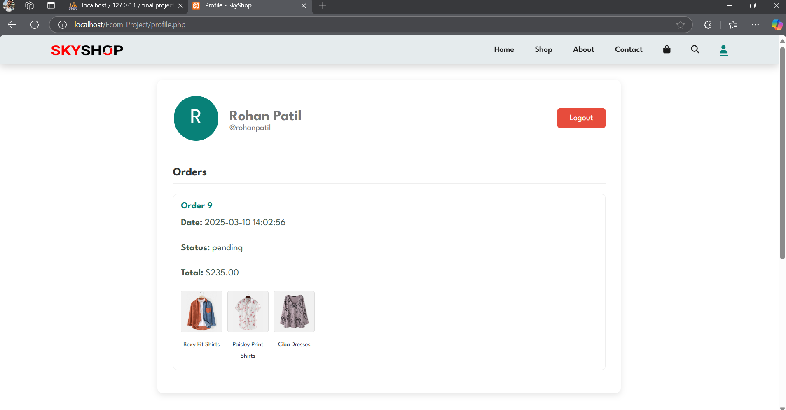

### 🔹 Order Confirmation
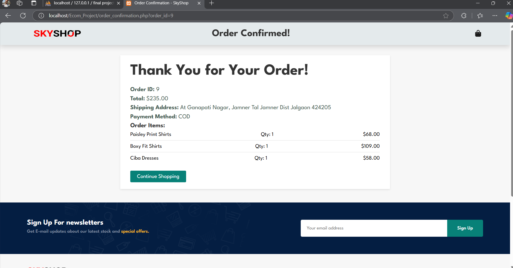

## 🧪 How to Run Locally

1. Install **XAMPP** and start Apache & MySQL.
2. Clone this repository:
3. Move the project folder to `htdocs` inside your XAMPP directory.
4. Import the SQL file (if any) using **phpMyAdmin** to create the database.
5. Open the project in your browser:

## 📁 Folder Structure

/Ecommerce-Website/
├── index.php
├── login.php
├── register.php
├── cart.php
├── admin/
├── css/
├── js/
├── images/
└── db/

## 👤 Author

**Rohan Patil**  
Bachelor of Computer Application (BCA) Graduate  
Email: patilrohan9012@gmail.com  
GitHub: [@patilrohhan](https://github.com/patilrohhan)

---

